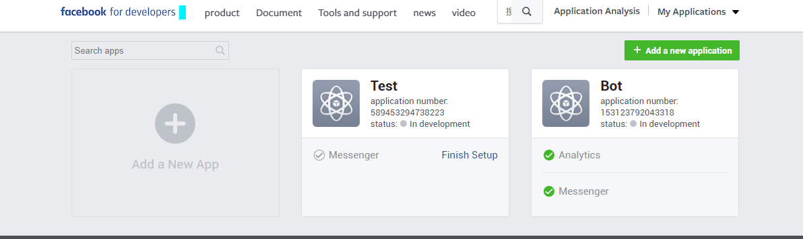
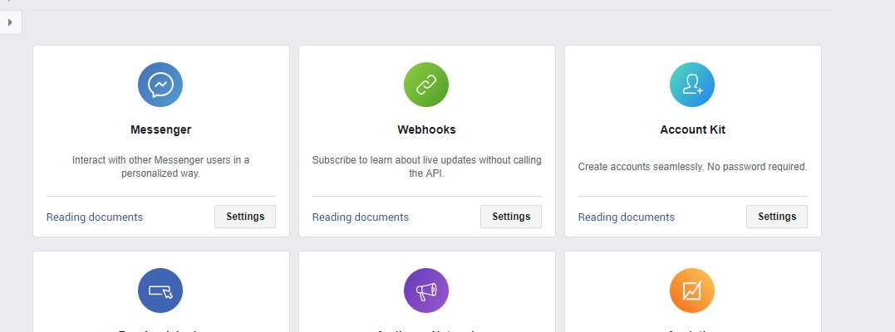
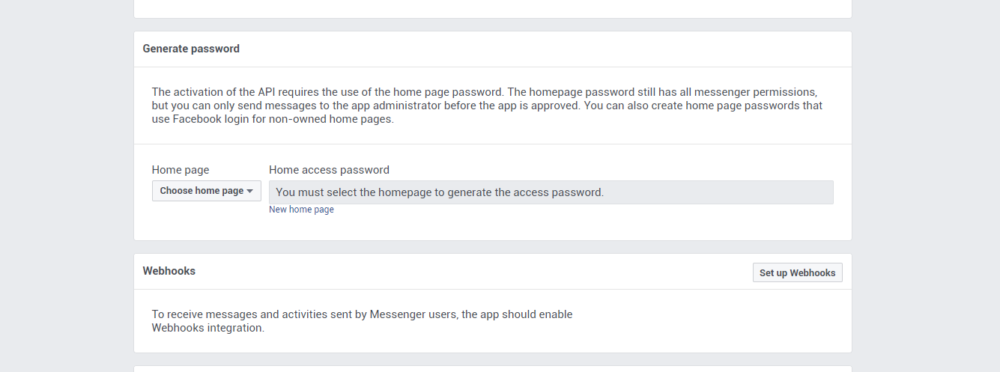
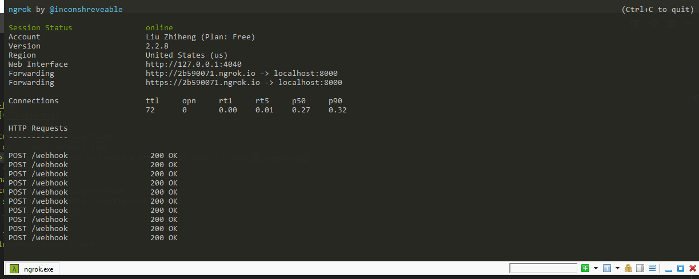

# SDI
SDI Academy Project - Messenger Bot

## setup

1. Create Facebook dev account
2. Create new app 
3. Click on messenger setting 
4. Create a facebook page from facebook
5. Change Home page to whatever page you create 
6. Click on Home access password to paste on ./config/default.json
7. run your web local server ( you may use nodemon and ngrok to create a https local host ) 
    npm install -g nodemon && nodemon <js file to run>
    ./ngrok http 8000 // on another terminal
8. copy the https domain set the webhook to https:/<something>/webhook
9. make sure you verified password is the same in config file ./config/default.json
10. make sure you have messages _postback _optins _deliveries
11. subscribe the home page under webhook
12. go to setting get secret key paste it in config
13. use your own server url if any since localhost doesn't work
14. done

## code

### ./classes
three type of user, place functions, replies, buttons here.
feel free to use variables or callbacks or Promises or Generators for changing stage
change UI, work with design team on icons and pictures. (as far as I discovered, pics with transparency won't work )

### ./config
config files, explained before

### ./app.js
main program

### ./ref.js
All the UIs included

### ./tools.js
Tool code for basic setup, shared, check whats inside.

#### This piece of code is not beautiful, but it works feel free to change the source code, if any doubts, ask me.